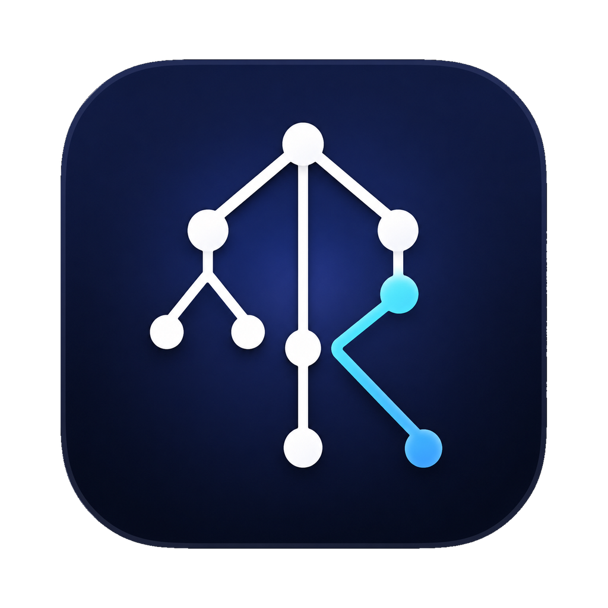

<div align="center">



# Rational

**Private, local AI chat for macOS — powered by various thinking modes.**


</div>

Rational is a native macOS app that runs open-weight language models entirely on your Mac.
Powered by a bundled [Pie](https://github.com/pie-project/pie) inference engine, it supercharges
local models using specialized _thinking profiles_.

## Early release

v0.1.2 is an early release, focusing on core functionality and bug fixes.
Since many components are still a work in progress, your feedback is incredibly valuable.
Feel free to report any issues you find!

## Why Rational

**Local models, with thinking modes.** Ollama and LM Studio hand you a model and
a prompt box. Rational adds **profiles** — named *thinking modes* you switch in
one click, each a saved preset bundling a model, sampling, a system prompt, and a
chat workflow.

- **Fast Think — speculative decoding by switching a profile.** Runs the same
  model greedily with a speculative drafter — fewer waits, identical output — on
  the bundled Apple-Silicon engine. No flags, no separate model: just pick it.
  It currently implements [Cacheback algorithm](https://www.yecl.org/publications/ma2025emnlp.pdf).
- **Tree of Thought — a search tree, in one click.** The Tree of Thought profile
  turns one question into a scored search: the engine branches, scores each branch
  1–10, and keeps the best beam — shown live in a foldable tree, then the chosen
  answer.

▶ **[See the animated walkthrough](https://shsym.github.io/RatioThink/landing)**

## Install

1. Download `Rational-arm64.dmg` (Apple Silicon) from
   [Releases](https://github.com/shsym/RatioThink/releases) and open it.
2. In the window that opens, drag **Rational.app** onto the **Applications** shortcut.
3. Open **Rational** from Applications and follow the first-launch wizard to download a
   starter model.

## Build from source

**Prerequisites:** an Apple Silicon Mac (arm64), macOS 14+, Xcode (with command-line tools), [XcodeGen](https://github.com/yonaskolb/XcodeGen)
(`brew install xcodegen`), and a Rust toolchain (`rustup`) — the build compiles the bundled Pie engine.

```bash
git clone --recurse-submodules https://github.com/shsym/RatioThink.git
cd RatioThink
make build          # generates RatioThink.xcodeproj, then builds Rational.app + helper
```

The repo uses git submodules (the Pie engine, plus `ds_store` + `mac_alias` under
`Scripts/vendor/` which `make dmg-arm64` needs to write the styled DMG window). If
you cloned without `--recurse-submodules`, initialize them:

```bash
git submodule update --init --recursive
```

To install a signed build into `/Applications` (verified end-to-end: helper + engine + a chat
round-trip), use `make install-app`. It needs an Apple "Apple Development" signing identity in your
keychain; override `DEVELOPMENT_TEAM` / `CODE_SIGN_IDENTITY` per machine. The background helper is
registered via `SMAppService`, which refuses an unsigned/ad-hoc agent — so signing is required for a
working install.

```bash
make install-app    # build, sign, install into /Applications, launch, verify
```

`make install-app` uses a local **Apple Development** identity. That is enough
to run and debug locally, but it is *not* a distribution identity — Gatekeeper
rejects it on download. Producing a DMG that passes `spctl` on other Macs
requires the notarized release flow below.

> **Unsigned / development builds.** A DMG or app you build yourself
> (`make dmg-arm64`) is *not* notarized, so Gatekeeper blocks it. For local
> use only, clear the quarantine flag — notarized release downloads never need
> this:
> ```bash
> xattr -dr com.apple.quarantine /Applications/Rational.app
> ```

## Troubleshooting / Collect diagnostics

If the app misbehaves, you can collect a diagnostics bundle to send to the developer.

**From the app** (if it opens): **Help → Collect Diagnostics…**. It writes a
`.zip` to your Desktop.

**From Terminal** (works even when the app or helper won't launch):

```bash
/Applications/Rational.app/Contents/Resources/collect-diagnostics.sh
```

This prints a short verdict (e.g. *quarantine present*, *helper never
launched*, *Gatekeeper rejected*, *engine failed*) and writes
`~/Desktop/Rational-diagnostics-<timestamp>.zip`. Attach that `.zip` to your
report.

The bundle contains app/helper versions, codesign + Gatekeeper + quarantine
status, the launchd helper state, the running-process list, recent macOS
Unified Logging for `com.ratiothink*`, recent crash reports, and the app's own
breadcrumb logs (`app.log` / `helper.log` / `engine.log`). It is **redacted**:
your home path is collapsed to `~` and obvious tokens are stripped. Chat
contents are **never** included — diagnostics carry logs, status, and config
metadata only. Flags: `--window <dur>` (Unified Logging look-back, default
`2h`) and `--out <path>`.

## Known issues

A few known issues in the v0.1.2 release, with workarounds:

- **Deleting a model that a profile uses as its default may need a restart to fully settle.**
  If a deleted model still appears selected, restart RatioThink and choose a new profile model
  ([tracking PR](https://github.com/shsym/RatioThink/pull/62)).
- **Some first-install chat polish is still pending.** If the initial prompt or composer layout
  looks odd, resize the window or start a new chat; the follow-up polish is tracked in
  [PR #59](https://github.com/shsym/RatioThink/pull/59).

## Repo layout

```
RatioThink/
├── App/            # Main SwiftUI app target (Rational.app)
├── Helper/         # SMAppService menu-bar helper (RationalHelper.app)
├── Shared/         # Cross-target Swift library (RatioThinkCore: engine client, XPC, models, persistence)
├── Inferlets/      # chat-apc inferlet (Rust → wasm) + prebuilt artifact
├── Resources/      # App icon + asset catalog
├── Scripts/        # Build, packaging, and end-to-end test scripts
├── Sources/        # SPM CLI tools used by the test harness
├── Tests/          # XCTest unit, scenario, and GUI tests
└── Vendor/pie/     # Pie engine (vendored submodule)
```

## Documentation

- [`docs/landing.html`](docs/landing.html) — an animated walkthrough of Rational's
  thinking modes (profiles, the live Tree of Thought search, and Fast Think
  speculative decoding). Open it in a browser.
- [`docs/ARCHITECTURE.md`](docs/ARCHITECTURE.md) — how the app, helper, pie engine, and
  `chat-apc` inferlet fit together (plus an interactive [`architecture.html`](docs/architecture.html)).
- [`TEST.md`](TEST.md) — test catalog and pre-PR gate: what to run for each change type.
- [`PARITY.md`](PARITY.md) — how each test tier maps to the real packaged-binary path, and every bypass it takes.

## License

[Apache-2.0](LICENSE)
